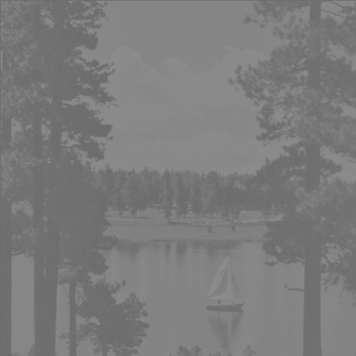

# Introduction to Computer Vision

In the era of deep learning, neural networks have revolutionized computer vision,
demonstrating their effectiveness in solving complex visual problems. Nevertheless, I
believe that conventional methods can still contribute to algorithmic improvement. For
example, [YOLO](https://arxiv.org/abs/1506.02640), a neural network-based object
detection method, can recognize objects in images but treats each image independently
without considering temporal connections. However, I propose that introducing a
continuous-time aspect, such as vehicle dynamics, into the detection process could
enhance precision and efficiency. This repository reflects my efforts to reacquaint
myself with traditional computer vision methodology.

## Description

This repository is organized by various computer vision topics. While some topics may
have connections (e.g., SIFT and RANSAC), they are discussed separately in different
sections for pedagogical clarity. I utilize open-source Python packages like Numpy,
Pillow, Scipy, scikit-image, etc. as needed, but it's important to note that
**`OpenCV`** is intentionally **prohibited**. The aim here is to foster a deep
understanding of the mathematical foundations behind each topic by implementing them
from scratch.

### Table of Contents

#### [Images as Functions](https://htmlpreview.github.io/?https://github.com/lionlai1989/Introduction_to_Computer_Vision/blob/master/00-Images_as_Functions/images_as_functions.html):

Images are not just collections of pixel values; they can be represented as mathematical
functions $f(x, y)$. This representation forms the foundation for various mathematical
operations, including filtering, Laplace/Fourier transforms, and convolution. The
initial notebook within this repository introduces the notation used and demonstrates
fundamental image operations such as reading, writing, addition, subtraction, and
standardization.

<div style="text-align:center">
  
  
  <p style="font-size: 14px; color: #777;">Left: original image. Right: image after standardization. Can you explain that why it looks so gray?</p>
</div>

#### [Hough Transform](https://htmlpreview.github.io/?https://github.com/lionlai1989/Introduction_to_Computer_Vision/blob/master/Hough_Transform/hough_transform.html):

The Hough Transform is a feature extraction technique used for identifying imperfect
instances of objects within a specific class of shapes through a voting procedure. In
this tutorial, I use the Hough Transform to detect lines and circles within images,
resulting in the image displayed below as the final outcome.

<div style="text-align:center">
  
  <p style="font-size: 14px; color: #777;">Detecing lines and circles with Hough transform.</p>
</div>

#### [Window-based Stereo Matching](https://htmlpreview.github.io/?https://github.com/lionlai1989/Introduction_to_Computer_Vision/blob/master/Window_based_Stereo_Matching/Window_based_Stereo_Matching.html):

Stereo matching is a fundamental task in computer vision that aims to recover the depth
information of a scene by comparing two or more images taken from slightly different
viewpoints. One common approach to stereo matching is the window-based method, which
relies on the concept of matching corresponding image regions to estimate disparities.

<div style="text-align:center">
  
  
  <p style="font-size: 14px; color: #777;">Left: ground truth disparity. Right: disparity map generated with cosine similarity cost function.</p>
</div>

#### [Stereo Geometry](https://htmlpreview.github.io/?https://github.com/lionlai1989/Introduction_to_Computer_Vision/blob/master/Stereo_Geometry/Stereo_Geometry.html):

Understanding multiple view geometry is a fundamental prerequisite for comprehending 3D
computer vision. In this tutorial, I explore the construction of camera projection
matrices and fundamental matrices between two views, followed by a discussion on the
rectification of stereo image pairs. My approach aligns with the algorithms detailed in
the authoritative reference, "Multiple View Geometry in Computer Vision," enabling us to
consult the original source for a comprehensive review of the material.

<div style="text-align:center">
  
  
  <p style="font-size: 14px; color: #777;">Left: Epipolar lines associated with 2D keypoints in the right image. Right: Epipolar lines associated with 2D keypoints in the left image. Notice that each epipolar line intersects precisely with its corresponding matching point, affirming the accuracy of the fundamental matrix estimation.</p>
</div>

<div style="text-align:center">
  
  
  <p style="font-size: 14px; color: #777;">Left: Rectified left image. Right: Rectified right image. Notice that each epipolar line continues to precisely intersect its corresponding matching point, and they all remain parallel to the x-axis, converging at infinity. In other words, the epipoles are located at infinity.</p>
</div>

#### [Particle Filter for Object Tracking](https://github.com/lionlai1989/Introduction_to_Computer_Vision/blob/master/Particle_Filter_for_Object_Tracking/Particle_Filter_for_Object_Tracking.ipynb):

The extended and unscented Kalman filters struggle to handle scenarios involving
multimodal probability distributions over the state. Particle filters, on the other
hand, excel in modeling multimodal uncertainty by representing the probability density
using a collection of particles within the state space.

The brief video below illustrates the tracking process of Mitt Romney's face using a
particle filter. In the upper-left corner, you can see the template used by the filter
in each time step. Initially, particles are randomly distributed across the image.
During the first 1 to 2 seconds, these particles exhibit rapid movement due to high
process and observation noise. As more observations are made by comparing the template
with the state of the particles, they gradually converge toward those with higher
weights. Throughout the entire process, the process noise decreases from 50 to 20, while
the observation noise decreases from 150 to 20. Importantly, the template is
continuously updated with the state of the optimal particle.

<div style="text-align:center">
  
  <p style="font-size: 14px; color: #777;">Particle filter for tracking Mitt Romney's head position.</p>
</div>

## Getting Started

All the results in Jupyter Notebook can be reproduced by following the instructions
below.

### Dependencies

Before you start, you need to make sure that **Python3** is installed. **Python-3.10**
is used throughout all the developments to the problems.

### Downloading

-   To download this repository, run the following command:

```shell
git clone https://github.com/lionlai1989/Introduction_to_Computer_Vision.git
```

### Install Python Dependencies

-   Create and activate a Python virtual environment

```
python3.10 -m venv venv_computer_vision && source venv_computer_vision/bin/activate
```

-   Update `pip` and `setuptools`:

```
python3 -m pip install --upgrade pip setuptools
```

-   Install required Python packages in `requirements.txt`.

```
python3 -m pip install -r requirements.txt
```

### Running Jupyter Notebook

Now you are ready to go to each Jupyter Notebook and run the code. Please remember to
select the kernel you just created in your virtual environment `venv_computer_vision`.

## Contributing

Any feedback, comments, and questions about this repository are welcome.

## Authors

[@lionlai](https://github.com/lionlai1989)

## Version History

-   0.0.1
    -   Initial Release

## Acknowledgments

The example images in this repository are primarily sourced from two courses:
'Introduction to Computer Vision' offered by Udacity and Georgia Tech, and 'Computer
Vision' from ETH Zürich. It's essential to emphasize that I do not possess ownership
rights over the example images included in this repository. For a more in-depth
exploration of the original course contents, please refer to the following links:

-   Georgia Tech:

    -   https://www.udacity.com/course/introduction-to-computer-vision--ud810
    -   https://docs.google.com/spreadsheets/d/1ecUGIyhYOfQPi3HPXb-7NndrLgpX_zgkwsqzfqHPaus/pubhtml

-   ETH Zürich:
    -   https://cvg.ethz.ch/teaching/compvis/
